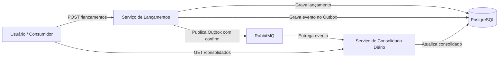
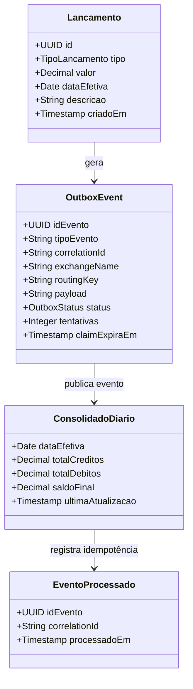
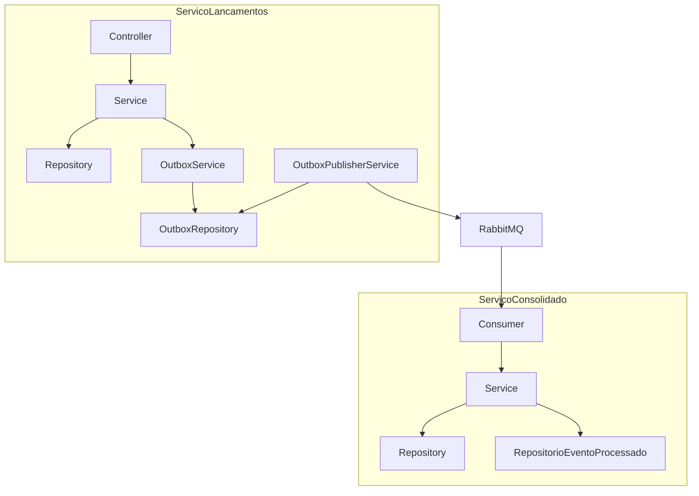
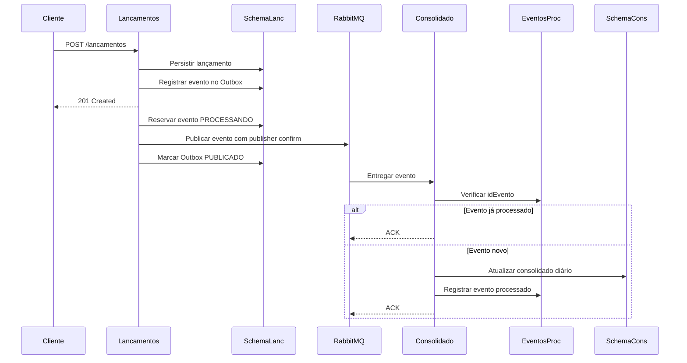
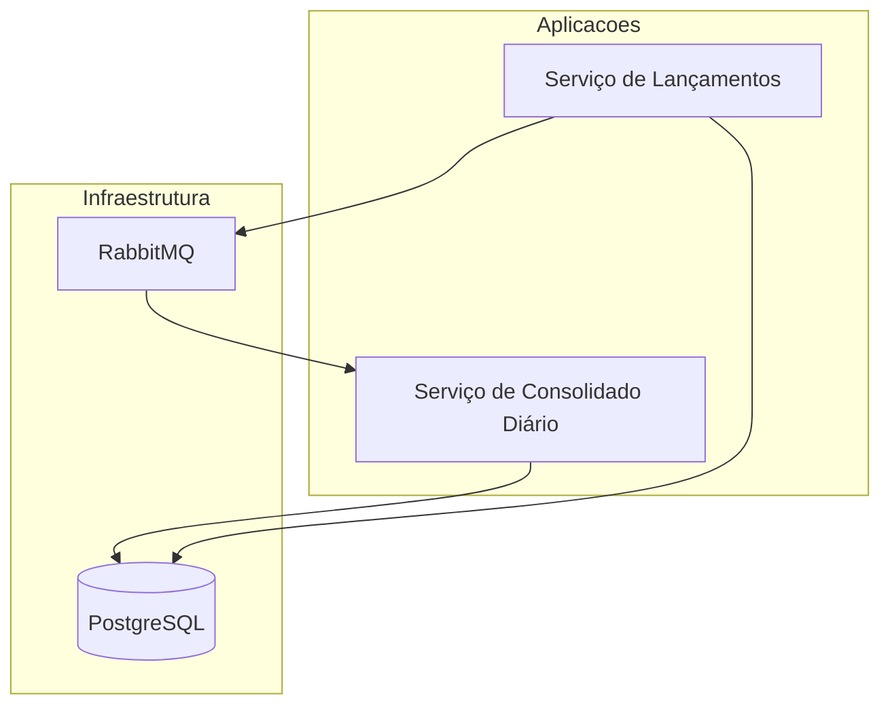

# Documento de Arquitetura – Serviço de Controle de Lançamentos e Consolidado Diário

## 1. Introdução

O escopo deste documento foi definido com foco em maximizar a evidência arquitetural e a verificabilidade técnica da solução, utilizando prova de conceito, diagramas e documentação acessória, priorizando a implementação dos fluxos essenciais de negócio e dos mecanismos mínimos necessários para demonstrar desacoplamento, resiliência e testabilidade. Componentes adicionais, relevantes para um ambiente produtivo, foram documentados com suas respectivas justificativas, trade-offs e estratégia de evolução.

O escopo do MVP foi definido com foco em demonstrar, de forma objetiva e verificável, os requisitos centrais da solução: controle de lançamentos, consolidação diária, desacoplamento entre serviços, resiliência básica e testabilidade.

Em vez de buscar cobertura exaustiva de todos os aspectos operacionais e produtivos, optou-se por uma implementação mínima real dos fluxos de maior valor arquitetural, complementada por documentação detalhada para os componentes cuja adoção, embora recomendável em contexto produtivo, apresentaria baixa relação custo-benefício no contexto da prova de conceito.

Essa abordagem visa evidenciar capacidade de priorização, tomada de decisão, análise de trade-offs e visão sistêmica, preservando clareza técnica e foco nos objetivos da solução.

---

## 2. Contexto de Negócio

Um comerciante necessita registrar lançamentos financeiros (débitos e créditos) e consultar o saldo diário consolidado.

A solução deve garantir:

- disponibilidade do registro de lançamentos;
- resiliência em caso de falhas;
- capacidade de escalar;
- clareza e rastreabilidade dos dados;
- simplicidade de execução local para avaliação técnica.

---

## 3. Mapeamento de Domínios Funcionais e Capacidades de Negócio

### 3.1 Domínios

- **Lançamentos Financeiros**
- **Consolidação Diária**

### 3.2 Capacidades de Negócio

- Registrar lançamentos
- Consultar lançamentos
- Consolidar saldo diário
- Consultar saldo consolidado
- Processar eventos com resiliência
- Auditar eventos processados
- Evoluir esquema de banco de forma versionada

---

## 4. Refinamento de Requisitos

### 4.1 Requisitos Funcionais

- Registrar lançamentos de crédito e débito
- Consultar lançamentos por período
- Consolidar saldo diário
- Consultar saldo consolidado diário
- Processar eventos de forma assíncrona
- Evitar dupla contabilização em reentregas de mensagens
- Subir a solução localmente com um único comando
- Disponibilizar documentação clara para execução e avaliação
- Hospedar o código em repositório público
- Disponibilizar README com instruções objetivas de funcionamento

### 4.2 Requisitos Não Funcionais

- **Disponibilidade:** o serviço de lançamentos não deve depender da disponibilidade imediata do consolidado
- **Resiliência:** falhas parciais não devem interromper o fluxo principal
- **Escalabilidade:** arquitetura preparada para crescimento independente entre escrita e consolidação
- **Segurança:** capacidade de evolução para autenticação e autorização robustas
- **Observabilidade:** capacidade de evoluir para métricas, logs estruturados e monitoramento
- **Testabilidade:** arquitetura simples de validar com testes unitários e integração
- **Manutenibilidade:** organização clara de módulos, diretórios e versionamento de banco

---

## 5. Arquitetura Alvo

### 5.1 Estilo Arquitetural

Arquitetura orientada a eventos, com serviços desacoplados e integração assíncrona.

### 5.2 Componentes Principais

- Serviço de Lançamentos
- Serviço de Consolidado Diário
- RabbitMQ
- PostgreSQL
- Liquibase embarcado em cada serviço para versionamento do banco

### 5.3 Justificativas Principais

Embora Apache Kafka também atendesse ao desacoplamento assíncrono entre serviços, optou-se por RabbitMQ devido ao menor custo de implantação e operação no contexto da prova de conceito, mantendo os benefícios necessários de desacoplamento, resiliência e absorção de picos sem introduzir complexidade excessiva.

Embora uma estratégia batch noturna fosse possível, optou-se por consolidação incremental orientada a eventos para reduzir latência de atualização, melhorar a experiência de consulta e demonstrar uma arquitetura mais aderente a cenários modernos de integração assíncrona.

A solução demonstra resiliência básica ao impedir que falhas no serviço de consolidado comprometam a disponibilidade do serviço de lançamentos, preservando a continuidade do fluxo transacional e permitindo reprocessamento posterior dos eventos pendentes.

Eu não descartei totalmente o monólito como opção técnica viável para cenários menores, mas, neste caso específico, considerei que a exigência de independência operacional entre lançamentos e consolidado tornava mais adequado um desenho desacoplado por serviços.

Embora versões mais recentes do Java ofereçam melhorias importantes de linguagem, desempenho e produtividade, optou-se por Java 11 com Spring Boot 2.7.x nesta prova de conceito em função da estabilidade do ecossistema, ampla maturidade das bibliotecas, compatibilidade consolidada e menor risco de implementação dentro do tempo disponível. Para o escopo da solução, os requisitos funcionais e não funcionais propostos podem ser plenamente atendidos com esse stack, sem prejuízo arquitetural.

---

## 6. Modelos de Domínio

### 6.1 Entidade `Lancamento`

| Campo | Tipo | Obrigatório | Descrição |
|---|---|---:|---|
| id | UUID | Sim | Identificador único do lançamento |
| tipo | Enum (`CREDITO`, `DEBITO`) | Sim | Tipo do lançamento |
| valor | Decimal | Sim | Valor monetário do lançamento |
| dataEfetiva | Date | Sim | Data usada na consolidação |
| descricao | String | Não | Descrição livre |
| criadoEm | Timestamp | Sim | Data/hora de criação |

### 6.2 Entidade `ConsolidadoDiario`

| Campo | Tipo | Obrigatório | Descrição |
|---|---|---:|---|
| dataEfetiva | Date | Sim | Dia de consolidação |
| totalCreditos | Decimal | Sim | Soma dos créditos |
| totalDebitos | Decimal | Sim | Soma dos débitos |
| saldoFinal | Decimal | Sim | Resultado líquido |
| ultimaAtualizacao | Timestamp | Sim | Momento da última consolidação |

### 6.3 Entidade `EventoProcessado`

| Campo | Tipo | Obrigatório | Descrição |
|---|---|---:|---|
| idEvento | UUID | Sim | Identificador único do evento consumido |
| processadoEm | Timestamp | Sim | Momento de conclusão do processamento |
| correlationId | UUID/String | Não | Identificador de correlação para rastreabilidade |

---

## 7. DTOs e Contratos de API

### 7.1 `LancamentoRequest`

```json
{
  "tipo": "CREDITO",
  "valor": 100.50,
  "dataEfetiva": "2026-04-17",
  "descricao": "Venda no caixa"
}
```

### 7.2 `LancamentoResponse`

```json
{
  "id": "8d4049d3-5de8-4d6b-9c1d-bf62c0b8fb21",
  "status": "RECEBIDO",
  "mensagem": "Lançamento registrado com sucesso"
}
```

### 7.3 `ConsolidadoResponse`

```json
{
  "dataEfetiva": "2026-04-17",
  "totalCreditos": 1000.00,
  "totalDebitos": 350.00,
  "saldoFinal": 650.00,
  "ultimaAtualizacao": "2026-04-17T14:30:00Z"
}
```

### 7.4 `ErroResponse`

```json
{
  "codigo": "VALIDACAO_NEGOCIO",
  "mensagem": "O valor do lançamento deve ser maior que zero",
  "timestamp": "2026-04-17T14:35:10Z"
}
```

---

## 8. Modelo de Eventos e Metadados de Mensageria

### 8.1 Evento `LancamentoRegistrado`

```json
{
  "idEvento": "9dba5453-8d1d-49cb-9774-5f7a3553f596",
  "correlationId": "corr-20260417-0001",
  "idLancamento": "8d4049d3-5de8-4d6b-9c1d-bf62c0b8fb21",
  "tipo": "CREDITO",
  "valor": 100.50,
  "dataEfetiva": "2026-04-17",
  "descricao": "Venda no caixa",
  "ocorridoEm": "2026-04-17T14:25:00Z",
  "versaoEvento": 1
}
```

### 8.2 Metadados Trafegados

- `idEvento`: identifica unicamente a mensagem
- `correlationId`: rastreia a jornada do evento
- `versaoEvento`: permite evolução de contrato
- `ocorridoEm`: registra o instante do fato gerador

### 8.3 Idempotência

Em mensageria, uma mesma mensagem pode ser entregue mais de uma vez. Para evitar dupla contabilização:

- cada evento possui `idEvento` único;
- o serviço de consolidado consulta a tabela `evento_processado`;
- se o evento já foi processado, a mensagem é ignorada com segurança;
- se for novo, o consolidado é atualizado e o evento é registrado.

### 8.4 Controle de Processamento

O controle de processamento usa Outbox no produtor e idempotência no consumidor:

- o lançamento e o registro de Outbox são gravados na mesma transação;
- o publisher reserva eventos `PENDENTE` ou `ERRO` como `PROCESSANDO`;
- a reserva possui `processandoPor`, `processandoEm` e `claimExpiraEm`;
- a publicação aguarda publisher confirm do RabbitMQ;
- falhas temporárias liberam o evento para nova tentativa com backoff;
- o ACK do consumidor só ocorre após atualização bem-sucedida do consolidado;
- a tabela `evento_processado` evita dupla contabilização.

---

## 9. Modelo de Dados Relacional

### 9.1 Tabela `lancamento`

| Coluna | Tipo | PK | Observações |
|---|---|---:|---|
| id | UUID | Sim | Identificador do lançamento |
| tipo | VARCHAR(20) | Não | `CREDITO` ou `DEBITO` |
| valor | NUMERIC(19,2) | Não | Valor monetário |
| data_efetiva | DATE | Não | Data usada no consolidado |
| descricao | VARCHAR(255) | Não | Texto livre |
| criado_em | TIMESTAMP | Não | Momento da criação |

### 9.2 Tabela `consolidado_diario`

| Coluna | Tipo | PK | Observações |
|---|---|---:|---|
| data_efetiva | DATE | Sim | Chave lógica do consolidado |
| total_creditos | NUMERIC(19,2) | Não | Soma dos créditos |
| total_debitos | NUMERIC(19,2) | Não | Soma dos débitos |
| saldo_final | NUMERIC(19,2) | Não | Resultado líquido |
| ultima_atualizacao | TIMESTAMP | Não | Última atualização |

### 9.3 Tabela `evento_processado`

| Coluna | Tipo | PK | Observações |
|---|---|---:|---|
| id_evento | UUID | Sim | Id do evento consumido |
| processado_em | TIMESTAMP | Não | Momento do sucesso |
| correlation_id | VARCHAR(100) | Não | Rastreabilidade |

### 9.4 Tabela `outbox_evento`

| Coluna | Tipo | PK | Observações |
|---|---|---:|---|
| id_evento | UUID | Sim | Id do evento |
| tipo_evento | VARCHAR(120) | Não | Tipo lógico do evento |
| correlation_id | VARCHAR(120) | Não | Correlação da jornada |
| exchange_name | VARCHAR(120) | Não | Exchange RabbitMQ |
| routing_key | VARCHAR(120) | Não | Routing key |
| payload | TEXT | Não | Corpo JSON do evento |
| status | VARCHAR(20) | Não | `PENDENTE`, `PROCESSANDO`, `PUBLICADO`, `ERRO` |
| tentativas | INT | Não | Quantidade de tentativas |
| proxima_tentativa_em | TIMESTAMP | Não | Próxima tentativa elegível |
| criado_em | TIMESTAMP | Não | Data de criação |
| atualizado_em | TIMESTAMP | Não | Última atualização |
| publicado_em | TIMESTAMP | Não | Publicação confirmada |
| processando_por | VARCHAR(120) | Não | Worker que reservou o evento |
| processando_em | TIMESTAMP | Não | Início da reserva |
| claim_expira_em | TIMESTAMP | Não | Expiração da reserva |
| ultimo_erro | VARCHAR(1000) | Não | Último erro |

---

## 10. Liquibase e Estratégia de Versionamento do Banco

A solução adota Liquibase dentro de cada serviço, por simplicidade operacional e autonomia por contexto.

### 10.1 Motivo da Escolha

- reduz o número de projetos da prova de conceito;
- mantém versionamento de banco acoplado ao contexto responsável;
- facilita execução local com um único comando;
- continua sendo uma abordagem realista para microserviços.

### 10.2 Estrutura Recomendada

```text
servico-lancamentos/
  src/main/resources/db/changelog/

servico-consolidado-diario/
  src/main/resources/db/changelog/
```

### 10.3 Arquivos Esperados

```text
db/changelog/
└── db.changelog-master.xml
```

e

```text
db/changelog/
└── db.changelog-master.xml
```

Na implementação atual, os changesets estão consolidados no `db.changelog-master.xml` de cada serviço para facilitar a leitura da POC. Em uma evolução produtiva, os changesets podem ser separados por arquivo mantendo o mesmo changelog master como orquestrador.

---

## 11. Estrutura de Projetos e Diretórios no GitHub

```text
servico-controle-lancamentos-consolidado/
├── README.md
├── docker-compose.yml
├── docs/
│   ├── arquitetura.md
│   ├── tradeoffs.md
│   ├── backlog-tecnico.md
│   ├── modelo-dominio.md
│   ├── modelo-dados.md
│   └── diagramas/
│       ├── drawio/
│       │   ├── 01-overview-big-picture.drawio
│       │   ├── 02-dominio.drawio
│       │   ├── 03-componentes.drawio
│       │   ├── 04-sequencia-lancamento.drawio
│       │   └── 05-integracao-infra.drawio
│       └── mermaid/
│           ├── 01-overview-big-picture.md
│           ├── 02-dominio.md
│           ├── 03-componentes.md
│           ├── 04-sequencia-lancamento.md
│           └── 05-integracao-infra.md
├── servico-lancamentos/
│   ├── README.md
│   ├── pom.xml
│   ├── Dockerfile
│   └── src/
│       ├── main/java/br/com/exemplo/lancamentos/
│       │   ├── controller/
│       │   ├── service/
│       │   ├── repository/
│       │   ├── model/
│       │   ├── dto/
│       │   ├── event/
│       │   ├── config/
│       │   └── exception/
│       └── main/resources/
│           ├── application.yml
│           └── db/changelog/
├── servico-consolidado-diario/
│   ├── README.md
│   ├── pom.xml
│   ├── Dockerfile
│   └── src/
│       ├── main/java/br/com/exemplo/consolidado/
│       │   ├── consumer/
│       │   ├── service/
│       │   ├── repository/
│       │   ├── model/
│       │   ├── dto/
│       │   ├── config/
│       │   └── exception/
│       └── main/resources/
│           ├── application.yml
│           └── db/changelog/
```

### 11.1 Observação Sobre a Pasta de Diagramas

Sim, a criação de uma pasta dedicada exclusivamente aos arquivos relacionados ao draw.io é uma excelente decisão. Isso mantém a documentação organizada, facilita manutenção e permite referenciar os diagramas no documento principal de arquitetura e no README.

---

## 12. Diagramas – Mermaid e Referências para Draw.io

### 12.1 Big Picture / Overview

Arquivo draw.io: [`docs/diagramas/drawio/01-overview-big-picture.drawio`](./diagramas/drawio/01-overview-big-picture.drawio)



### 12.2 Domínio

Arquivo draw.io: [`docs/diagramas/drawio/02-dominio.drawio`](./diagramas/drawio/02-dominio.drawio)



### 12.3 Componentes Internos

Arquivo draw.io: [`docs/diagramas/drawio/03-componentes.drawio`](./diagramas/drawio/03-componentes.drawio)



### 12.4 Sequência do Fluxo de Lançamento

Arquivo draw.io: [`docs/diagramas/drawio/04-sequencia-lancamento.drawio`](./diagramas/drawio/04-sequencia-lancamento.drawio)



### 12.5 Integração e Infraestrutura

Arquivo draw.io: [`docs/diagramas/drawio/05-integracao-infra.drawio`](./diagramas/drawio/05-integracao-infra.drawio)



---

## 13. Trade-offs

| Decisão | Alternativa | Benefício | Custo/Complexidade | Decisão adotada | Justificativa |
|--------|------------|-----------|---------------------|-----------------|--------------|
| Separação em serviços | Monólito | Isolamento de falhas, escalabilidade independente | Maior complexidade operacional | Serviços desacoplados | Necessidade de independência entre lançamentos e consolidado |
| Integração assíncrona | Integração síncrona | Resiliência, desacoplamento, absorção de picos | Consistência eventual | Assíncrona via broker | Atende requisito de disponibilidade do serviço de lançamentos |
| RabbitMQ vs Kafka | Kafka | Simplicidade, menor custo operacional | Menor capacidade de streaming massivo | RabbitMQ | Melhor custo-benefício para POC |
| Consolidação incremental | Batch noturno | Baixa latência, melhor experiência de consulta | Necessidade de idempotência | Incremental por evento | Melhor aderência à solução |
| Banco único vs múltiplos bancos | Banco por serviço | Simplicidade operacional | Menor isolamento físico | Banco único com schemas | Redução de complexidade na POC |
| Liquibase por serviço | Projeto de migração separado | Simplicidade e autonomia | Menor separação física entre app e schema | Liquibase no serviço | Melhor equilíbrio entre robustez e entrega |

---

## 14. Backlog Técnico e Explicações

### 14.1 Alta Prioridade

#### Outbox
Outbox é um padrão arquitetural usado para evitar inconsistência entre persistência em banco e publicação em mensageria. Em vez de gravar o lançamento e publicar diretamente na fila no mesmo fluxo sem garantia transacional, o sistema grava um registro em uma tabela de outbox dentro da mesma transação do banco. Um processo posterior publica o evento para a fila e marca o item como publicado. Isso reduz o risco de o lançamento ser salvo e a mensagem não ser enviada.

#### DLQ
DLQ significa **Dead Letter Queue**. É uma fila destinada a mensagens que falharam repetidamente e não puderam ser processadas com sucesso. Serve para isolar mensagens problemáticas, impedir bloqueio do fluxo principal e permitir análise posterior.

#### Retry
Retry é a estratégia de tentar novamente o processamento de uma mensagem ou chamada que falhou por motivo transitório. Pode ser usado com backoff progressivo para evitar tempestade de reprocessamento.

#### OAuth2
OAuth2 é um protocolo de autorização amplamente utilizado para delegação segura de acesso via tokens. Pode ser aplicado para proteger APIs externas, controlar escopos de acesso e integrar com provedores corporativos de identidade.

### 14.2 Média Prioridade

#### Redis
Redis é um banco em memória, extremamente rápido, frequentemente usado como cache. Pode ser utilizado para armazenar temporariamente respostas de consulta do consolidado, reduzindo latência e carga no banco relacional.

#### API Gateway
API Gateway é a camada de entrada centralizada para APIs. Pode concentrar autenticação, roteamento, rate limiting, versionamento e observabilidade de borda.

### 14.3 Justificativa do Backlog

Os itens acima foram deliberadamente postergados por apresentarem maior custo de implementação em relação ao valor incremental para o MVP, sendo mais adequados para evolução em ambiente produtivo.

---

## 15. Testes

### 15.1 Testes Unitários Recomendados

- cálculo do saldo consolidado
- validação de lançamentos inválidos
- idempotência no consumidor

### 15.2 Testes de Integração Recomendados

- cadastro de lançamento com persistência
- publicação de evento
- consumo e atualização do consolidado
- reprocessamento seguro de evento duplicado

---

## 16. README e Execução Local

### 16.1 README Raiz

O README principal deve conter:

- visão geral da solução;
- arquitetura resumida;
- pré-requisitos;
- como subir tudo com um único comando;
- endpoints principais;
- estrutura do repositório;
- referência aos diagramas.

### 16.2 READMEs por Serviço

Cada serviço deve conter README próprio explicando:

- propósito do módulo;
- como rodar isoladamente;
- principais endpoints ou consumidores;
- relação com banco e Liquibase.

### 16.3 Subida Local com Docker Compose

A solução possui três modos de execução:

```bash
docker compose up --build
```

Sobe o core funcional: PostgreSQL, RabbitMQ, Nginx e as quatro réplicas dos serviços.

```bash
docker compose --profile observability up --build
```

Sobe o core mais Prometheus e Grafana.

```bash
docker compose --profile full-ops up --build
```

Sobe a stack completa com Loki, Promtail, Alertmanager e exporters.

O passo a passo operacional detalhado está em [`execucao-testes.md`](execucao-testes.md).

O modo core deve:

- subir PostgreSQL;
- subir RabbitMQ;
- subir duas réplicas do serviço de lançamentos;
- subir duas réplicas do serviço de consolidado diário;
- subir Nginx como load balancer;
- aplicar migrações Liquibase;
- expor serviços para teste local.

---

## 17. Estratégia de Versionamento com Gitflow

Estratégia recomendada:

- `main`: versão estável
- `develop`: integração contínua do desenvolvimento
- `feature/*`: novas funcionalidades
- `release/*`: preparação de versão
- `hotfix/*`: correções emergenciais

### Fluxo Sugerido

1. criar branch a partir de `develop`
2. desenvolver e testar
3. abrir merge para `develop`
4. consolidar release
5. promover para `main`

---

## 18. Conclusão

A solução equilibra simplicidade de implementação e robustez arquitetural, priorizando os elementos fundamentais para demonstrar domínio técnico, visão sistêmica, capacidade de decisão e clareza de evolução futura. O MVP representa apenas parte do projeto completo, enquanto a documentação arquitetural cobre de forma mais ampla os requisitos funcionais e não funcionais esperados, além das estratégias de evolução para um cenário produtivo.
