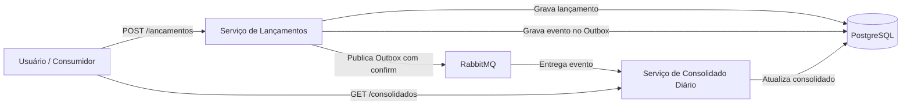

```mermaid
flowchart LR
    U[Usuário / Consumidor]
    L[Serviço de Lançamentos]
    C[Serviço de Consolidado Diário]
    MQ[RabbitMQ]
    DB[(PostgreSQL)]

    U -->|POST /lancamentos| L
    U -->|GET /consolidados| C
    L -->|Grava lançamento| DB
    L -->|Grava evento no Outbox| DB
    L -->|Publica Outbox com confirm| MQ
    MQ -->|Entrega evento| C
    C -->|Atualiza consolidado| DB
```
