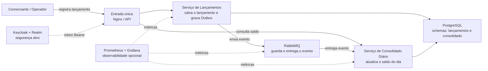

```mermaid
flowchart LR
    U["Comerciante / Operador"]
    G["Entrada única<br/>Nginx / API"]
    L["Serviço de Lançamentos<br/>salva o lançamento e grava Outbox"]
    R["RabbitMQ<br/>guarda e entrega o evento"]
    C["Serviço de Consolidado Diário<br/>atualiza o saldo do dia"]
    DB["PostgreSQL<br/>schemas: lançamentos e consolidado"]
    O["Prometheus + Grafana<br/>observabilidade opcional"]
    S["Keycloak + Realm<br/>segurança alvo"]

    U -->|registra lançamento| G
    G --> L
    G -->|consulta saldo| C
    L -->|envia evento| R
    R -->|entrega evento| C
    L --> DB
    C --> DB
    O -. métricas .-> L
    O -. métricas .-> C
    O -. métricas .-> R
    S -. token Bearer .-> G
```
