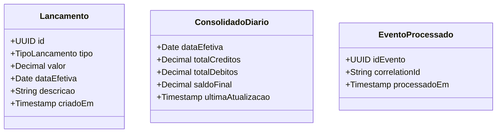

```mermaid
classDiagram
    class Lancamento {
        +UUID id
        +TipoLancamento tipo
        +Decimal valor
        +Date dataEfetiva
        +String descricao
        +Timestamp criadoEm
    }

    class ConsolidadoDiario {
        +Date dataEfetiva
        +Decimal totalCreditos
        +Decimal totalDebitos
        +Decimal saldoFinal
        +Timestamp ultimaAtualizacao
    }

    class EventoProcessado {
        +UUID idEvento
        +String correlationId
        +Timestamp processadoEm
    }
```