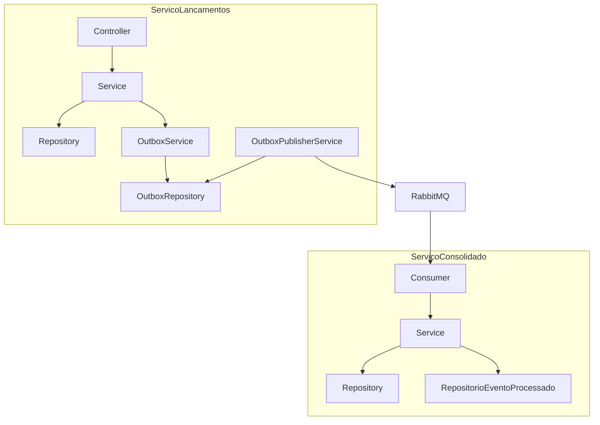

```mermaid
flowchart TB
    subgraph ServicoLancamentos
        LC[Controller]
        LS[Service]
        LR[Repository]
        OS[OutboxService]
        OP[OutboxPublisherService]
        OR[OutboxRepository]
    end

    subgraph ServicoConsolidado
        CC[Consumer]
        CS[Service]
        CR[Repository]
        CE[RepositorioEventoProcessado]
    end

    LC --> LS
    LS --> LR
    LS --> OS
    OS --> OR
    OP --> OR
    OP --> MQ[RabbitMQ]
    MQ --> CC
    CC --> CS
    CS --> CR
    CS --> CE
```
