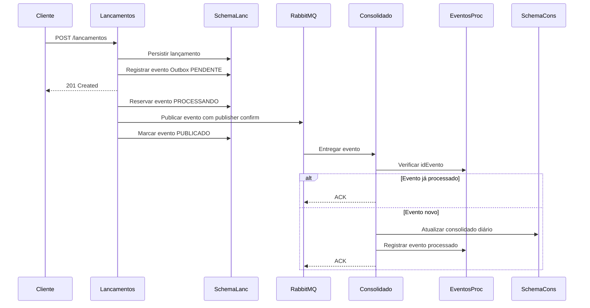

```mermaid
sequenceDiagram
    participant Cliente
    participant Lancamentos
    participant SchemaLanc
    participant MQ as RabbitMQ
    participant Consolidado
    participant EventosProc
    participant SchemaCons

    Cliente->>Lancamentos: POST /lancamentos
    Lancamentos->>SchemaLanc: Persistir lançamento
    Lancamentos->>SchemaLanc: Registrar evento Outbox PENDENTE
    Lancamentos-->>Cliente: 201 Created
    Lancamentos->>SchemaLanc: Reservar evento PROCESSANDO
    Lancamentos->>MQ: Publicar evento com publisher confirm
    Lancamentos->>SchemaLanc: Marcar evento PUBLICADO
    MQ->>Consolidado: Entregar evento
    Consolidado->>EventosProc: Verificar idEvento
    alt Evento já processado
        Consolidado-->>MQ: ACK
    else Evento novo
        Consolidado->>SchemaCons: Atualizar consolidado diário
        Consolidado->>EventosProc: Registrar evento processado
        Consolidado-->>MQ: ACK
    end
```
