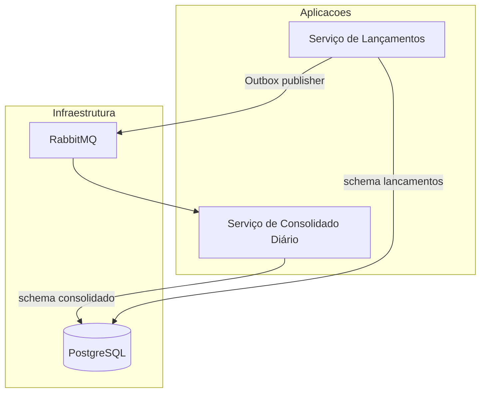

```mermaid
flowchart TB
    subgraph Aplicacoes
        L[Serviço de Lançamentos]
        C[Serviço de Consolidado Diário]
    end

    subgraph Infraestrutura
        MQ[RabbitMQ]
        PG[(PostgreSQL)]
    end

    L -->|Outbox publisher| MQ
    MQ --> C
    L -->|schema lancamentos| PG
    C -->|schema consolidado| PG
```
